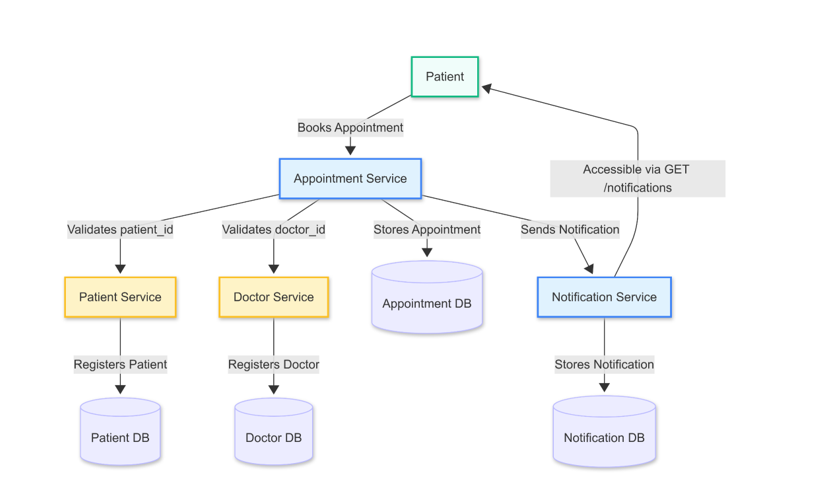

# SOA-915 Final Project 
## Hospital Appointment System

A containerized, microservices-based Hospital Appointment System built with Flask and PostgreSQL. Deployed on Kubernetes (Minikube) with integrated monitoring and logging using Prometheus, Grafana, and Loki.

---

## 📚 Table of Contents

- [Overview](#overview)  
- [Architecture](#architecture)  
- [Tech Stack](#tech-stack)  
- [Features](#features)  
- [Getting Started](#getting-started)  
- [Microservice Structure](#microservice-structure)  
- [Deployment](#deployment)  
- [Monitoring & Logging](#monitoring--logging)  
- [CI/CD](#cicd)

---

## Overview

This system allows patients to book appointments with doctors. When appointments are created, updated, or deleted, notifications are generated. The services communicate through RESTful APIs and run in a Kubernetes cluster using Minikube for local deployment.

---

## Architecture

- Microservices: Patient, Doctor, Appointment, Notification  
- Independent PostgreSQL databases per service  
- RESTful communication  
- JWT-based access control  
- Kubernetes for orchestration  
- Monitoring: Prometheus + Grafana  
- Logging: Loki + Promtail




---

## Tech Stack

| Component        | Tool / Framework           |
|------------------|----------------------------|
| Language         | Python 3.12                |
| Framework        | Flask                      |
| Database         | PostgreSQL                 |
| Containerization | Docker                     |
| Orchestration    | Kubernetes (Minikube)      |
| CI/CD            | GitHub Actions             |
| Monitoring       | Prometheus, Grafana        |
| Logging          | Loki, Promtail             |
| Testing          | pytest                     |

---

## Features

- CRUD APIs for all entities  
- Notification service with appointment-based triggers  
- Patient-specific notification filtering (via `X-Patient-ID`)  
- JWT-based API access control  
- Centralized logging (Loki)  
- Horizontal Pod Autoscaling (HPA)  
- CI/CD with GitHub Actions  

---

## Getting Started

### Prerequisites

- Python 3.12  
- Docker  
- Minikube  
- Helm  
- kubectl  

### Clone the Repository

```bash
git clone https://github.com/beidysy/SOA-915-Final-Project-Group-3.git
cd SOA-915-Final-Project-Group-3

```
### Microservice Structure
Each microservice follows the same structure:

├── app.py             # Flask app entry point  
├── models.py          # SQLAlchemy models  
├── routes.py          # API routes  
├── config.py          # Environment configuration  
├── requirements.txt   # Python dependencies  
├── Dockerfile         # Docker image configuration  

### Deployment
Start Minikube

```bash
minikube start --cpus=4 --memory=8192
eval $(minikube docker-env)
```

Build Docker Images
```bash
docker build -t patient-service:latest ./patient-service
docker build -t doctor-service:latest ./doctor-service
docker build -t appointment-service:latest ./appointment-service
docker build -t notification-service:latest ./notification-service

```

Load Images into Minikube
```bash
minikube image load patient-service:latest
minikube image load doctor-service:latest
minikube image load appointment-service:latest
minikube image load notification-service:latest
```

Deploy Services to Kubernetes
```bash
kubectl apply -f k8s/postgres/
kubectl apply -f k8s/patient-service/
kubectl apply -f k8s/doctor-service/
kubectl apply -f k8s/appointment-service/
kubectl apply -f k8s/notification-service/

```
### Monitoring & Logging
Deploy Monitoring Stack (Prometheus + Grafana)
```bash
kubectl create namespace monitoring
helm repo add prometheus-community https://prometheus-community.github.io/helm-charts
helm install prometheus prometheus-community/kube-prometheus-stack -n monitoring

```

Deploy Logging Stack (Loki + Promtail)
```bash
kubectl create namespace logging
helm repo add grafana https://grafana.github.io/helm-charts
helm install loki grafana/loki-stack -n logging --set grafana.enabled=true --set promtail.enabled=true

```

Access Grafana Dashboard
```bash
kubectl port-forward svc/loki-grafana -n logging 3000:80

```

Open your browser and visit:
http://localhost:3000
Login credentials:

Username: admin

Password: prom-operator
Example Loki Query
rate({container="appointment-service"}[1m])


### CI/CD
This project uses GitHub Actions to automate testing, image builds, and deployment.

Trigger Events
Push to main branch

Pull request to main branch

Workflow Overview
Check out source code

Run unit tests with pytest

Build Docker images for each microservice

Deploy to Minikube using deploy.sh

The workflow is defined in:
```bash
.github/workflows/main.yml

```
